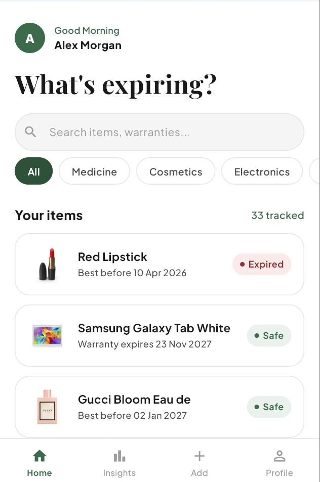
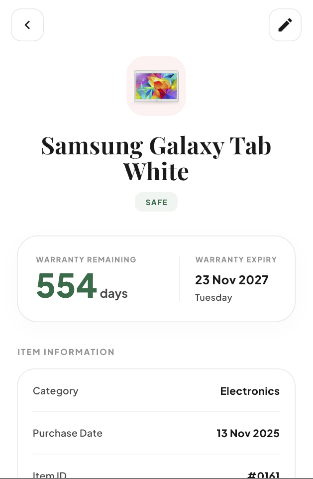
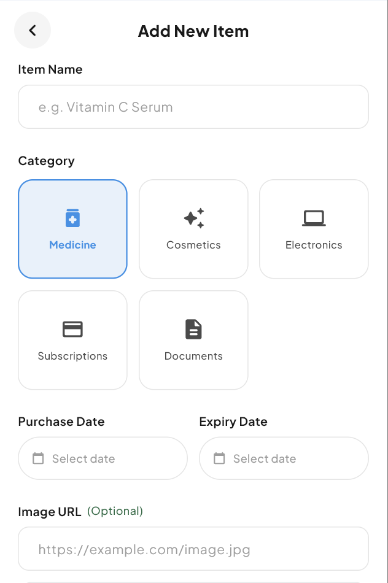
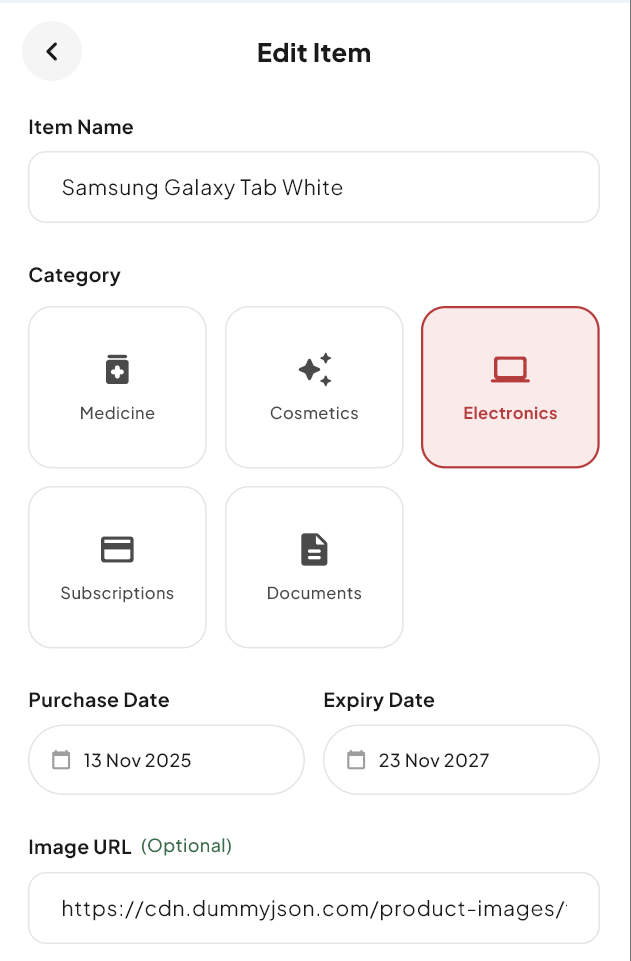
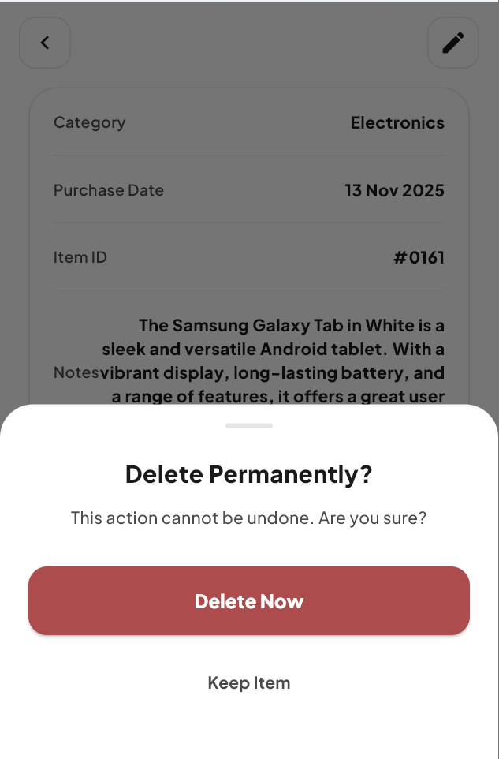
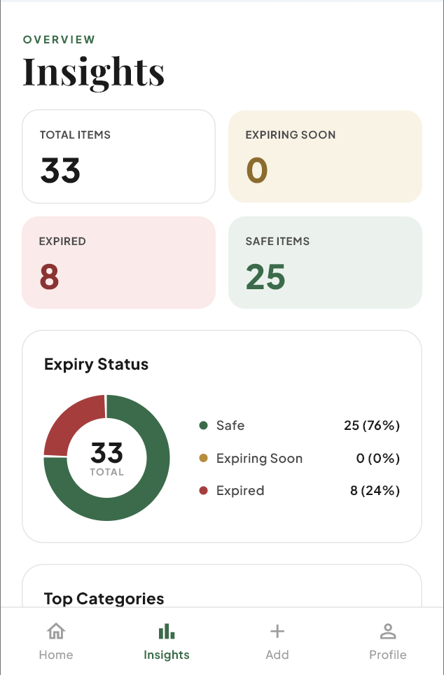

# DueGuard 

DueGuard helps you stay on top of expiry dates before they catch you off guard. You can track warranties, medicine, cosmetics, subscriptions, and documents — add items with a custom expiry date, and the app automatically calculates whether each one is Safe, Due Soon, Urgent, or Expired.

## Features

- Full CRUD via the DummyJSON public REST API
- Provider state management with `ChangeNotifier`
- Real-time search and category chip filtering
- Status tracking — Safe, Soon, Urgent, Expired — auto-calculated from expiry date
- Shimmer skeleton on load, optimistic delete, offline error banner

## Tech Stack

| | Library | Version |
|---|---|---|
| State management | `provider` | `^6.1.5+1` |
| HTTP client | `http` | `^1.6.0` |
| Fonts | `google_fonts` | `^6.2.1` |
| API | [DummyJSON](https://dummyjson.com) | public, no auth |

## API & Data

Item data is fetched from the [DummyJSON](https://dummyjson.com) public REST API. On first load, the app pulls real products from the Cosmetics and Electronics categories. Medicine, Subscriptions, and Documents have no equivalent in DummyJSON, so they start empty by design — users populate them by adding items via the Create form, which fires a real `POST /products/add` to the API. DummyJSON accepts all HTTP methods and returns valid responses but does not persist changes server-side; the app handles this by updating local state in `ItemProvider` immediately after each successful response.

| Operation | Method | Endpoint |
|---|---|---|
| Read | GET | `/products/category/{slug}` |
| Create | POST | `/products/add` |
| Update | PUT | `/products/{id}` |
| Delete | DELETE | `/products/{id}` |

## Author

| | |
|---|---|
| **Name** | Mulualem Gebreegziabher |
| **ID** | UGR/2363/16 |
| **Assignment** | Assignment 1 — Flutter CRUD with Provider & http |

## Screenshots

### Get Started

### Home

### Detail

### Add Item

### Edit Item

### Delete Item

### Analytics

